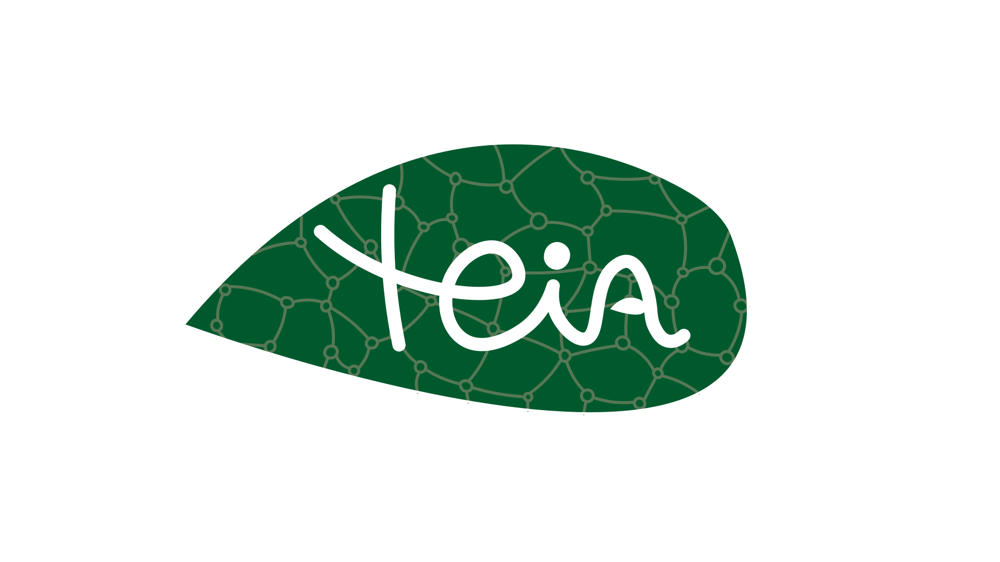
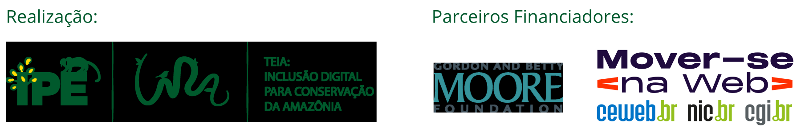

# Teia Admin

## Wiki
- [Guia de instalação do projeto](./docs/Installation.md)
- [Contratos da API Rest](./docs/API.md)

## Apresentação
O Projeto Teia consiste em um ecossistema de aplicações idealizado pelo [Lira | IPÊ](https://lira.ipe.org.br) e desenvolvido pelo [Terrakrya](https://www.terrakrya.com). Tendo como principal objetivo democratizar o acesso à informação para parceiros de Organicações de Base Comunitária da Amazônia. 

Os principais pilares do projeto são:  
1. Disponibilização de conteúdo adaptado para a linguagem da população local.
2. Presença nos principais aplicativos de mensagens (já adotados pelas comunidades).
3. Entrega de conteúdo da Trilha Formativa de maneira guiada através de um Chatbot.
4. Otimizações na entrega de mídia para garantir um baixo consumo de dados.
5. Desburocratização do processo de criação de cursos lessionados na web.

### Sobre o projeto
O [Teia Admin](https://github.com/devsdoprojetoteia/teia-admin) é o backend do Teiabot. Responsável por gerir os acessos de usuários e o conteúdo disponibilizado na plataforma, seja através do próprio chatbot (de maneira guiada) ou na web (não guiada), por meio do [Portal Teia](https://teia.ipe.org.br).

#### Funcionalidades disponíveis
- ✅ Gerenciamento de Sessão/Login
- ✅ CRUD de Alunos
- ✅ CRUD de Administradores
- ✅ CRUD de Cursos

#### Próximos passos
- ⌛ CRUD de Jornadas do Chatbot
- ⌛ Integração com Mensageiro
- ⌛ Montagem dinâmica do Portal do Aluno
- ⌛ CRUD de Progresso do aluno
- ⌛ CRUD de Conteúdo do módulo
- ⌛ CRUD de Módulos do curso
- ⌛ CRUD de Exercícios do conteúdo
- ⌛ PWA do Portal do Aluno
- ⌛ CRUD de Respostas dos exercícios
- ⌛ CRUD de Tutores
- ⌛ CRUD de Atendentes de Suporte
- ⌛ CRUD de Chamados de Suporte
- ⌛ CRUD de Comentários do conteúdo
- ⌛ Exportação de Relatórios
- ⌛ Agendamento de Jobs
- ⌛ Envio de e-mails

#### Documentação
[Atores](./docs/atores.md)
[Casos de Uso](./docs/casos_de_uso.md)
[Divisão de módulos](./docs/divisão_de_módulos.md)

## Design (UX/UI)
[Figma](https://www.figma.com/design/nMztAvNEU8KpG0HocEu4sk/Portal-TEIA?node-id=0-1&p=f&t=lVjwHLjAovrlAtKa-0)

## Parceiros & colaboradores
- [Mover-se na Web](https://moverse.ceweb.br)
- [Lira | IPÊ](https://lira.ipe.org.br)
- [Terrakrya](https://www.terrakrya.com)

