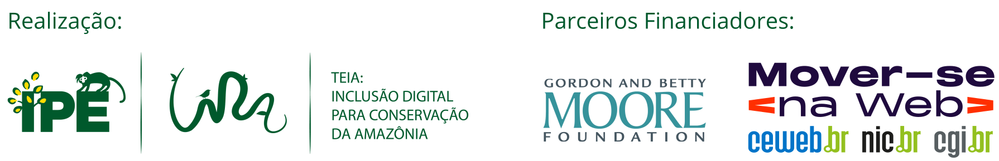

# TEIA Admin

## Wiki
- [Guia de instalação do projeto](./docs/Installation.md)
- [Contratos da API Rest](./docs/API.md)

## Apresentação
O Projeto TEIA consiste em um ecossistema de aplicações idealizado pelo [Lira | IPÊ](https://lira.ipe.org.br) e desenvolvido pelo [Terrakrya](https://www.terrakrya.com). Tendo como principal objetivo democratizar o acesso à informação para parceiros de Organicações de Base Comunitária da Amazônia. 

Os principais pilares do projeto são:  
1. Disponibilização de conteúdo adaptado para a linguagem da população local.
2. Presença nos principais aplicativos de mensagens (já adotados pelas comunidades).
3. Entrega de conteúdo da Trilha Formativa de maneira guiada através de um Chatbot.
4. Otimizações na entrega de mídia para garantir um baixo consumo de dados.
5. Desburocratização do processo de criação de cursos lessionados na web.

### Sobre o projeto
O [TEIA Admin](https://github.com/devsdoprojetoteia/teia-admin) é o backend do TEIAbot. Responsável por gerir os acessos de usuários e o conteúdo disponibilizado na plataforma, seja através do próprio chatbot (de maneira guiada) ou na web (não guiada), por meio do [Portal TEIA](https://teia.ipe.org.br).

#### Funcionalidades disponíveis
- ✅ Gerenciamento de Sessão/Login
- ✅ CRUD de Alunos
- ✅ CRUD de Administradores
- ✅ CRUD de Cursos
- ✅ CRUD de Conteúdo do módulo
- ✅ CRUD de Módulos do curso

#### Próximos passos
- ⌛ CRUD de Jornadas do Chatbot
- ⌛ Integração com Mensageiro
- ⌛ Montagem dinâmica do Portal do Aluno
- ⌛ CRUD de Progresso do aluno
- ⌛ CRUD de Exercícios do conteúdo
- ⌛ PWA do Portal do Aluno
- ⌛ CRUD de Respostas dos exercícios
- ⌛ CRUD de Tutores
- ⌛ CRUD de Atendentes de Suporte
- ⌛ CRUD de Chamados de Suporte
- ⌛ CRUD de Comentários do conteúdo
- ⌛ Exportação de Relatórios
- ⌛ Agendamento de Jobs
- ⌛ Envio de e-mails

#### Estrutura do Projeto

Esta seção descreve a organização das pastas do projeto e suas respectivas funções:

**📁 `/assets`**  
Contém recursos estáticos compilados:
- `css/`: Estilos Sass principais e configurações do projeto
- `img/`: Imagens utilizadas na aplicação

**📁 `/components`**  
Componentes Vue reutilizáveis da aplicação:
- Componentes de formulário (ex: `CourseForm.vue`, `UserForm.vue`, `TopicForm.vue`)
- Componentes de interface (ex: `Button.vue`, `Card.vue`, `Dialog.vue`, `Loading.vue`)
- Componentes específicos de domínio (ex: `CourseInfo.vue`, `ModuleInfo.vue`)
- Subpastas organizadas por contexto (ex: `courses/`, `modules/`, `topics/`, `common/`)

**📁 `/composables`**  
Composables Vue 3 para lógica reutilizável:
- `useApiAuth.ts`: Gerenciamento de autenticação via API
- `useAuth.ts`: Estado e lógica de autenticação
- `useBreakpoints.ts`: Responsividade e breakpoints
- `useCourses.ts`, `useModules.ts`, `useTopics.ts`: Lógica específica de cada entidade
- `useNotify.ts`: Sistema de notificações
- `useUsers.ts`: Gerenciamento de usuários

**📁 `/data`**  
Arquivos de dados estáticos (ex: `feriados.json`)

**📁 `/docs`**  
Documentação do projeto:
- Guias de instalação e API
- Documentação de casos de uso, atores e arquitetura
- Assets visuais para documentação

**📁 `/layouts`**  
Layouts de página do Nuxt:
- `authenticated.vue`: Layout para rotas autenticadas
- `public.vue`: Layout para rotas públicas

**📁 `/middleware`**  
Middleware de rotas do Nuxt:
- `authenticated.ts`: Proteção de rotas que requerem autenticação
- `public.ts`: Middleware para rotas públicas

**📁 `/models`**  
Definições TypeScript dos modelos de dados:
- Modelos de domínio (ex: `user.ts`, `course.ts`, `module.ts`, `topic.ts`)
- Modelos auxiliares (ex: `auth.ts`, `token.ts`, `notification.ts`, `dynamic-form.ts`)

**📁 `/pages`**  
Páginas/rotas do Nuxt (rotas baseadas em estrutura de arquivos):
- Rotas públicas: `entrar.vue`, `cadastrar.vue`, `recuperar-senha.vue`
- Rotas autenticadas: `painel.vue`, `cursos/`, `contas.vue`, `atividades.vue`, `relatorios.vue`
- Rotas dinâmicas: `courses/[id]/`, `topics/[id]/`, `curso/[courseId]/[topicId]/`

**📁 `/plugins`**  
Plugins do Nuxt (carregados na inicialização):
- `api.ts`: Configuração do cliente HTTP e repositórios
- `vuetify.js`: Configuração do framework Vuetify
- `vee-validate.client.ts`: Configuração de validação de formulários
- `masks.ts`: Máscaras de entrada de dados
- Outros plugins de terceiros (Quill, Lightbox, Utils)

**📁 `/public`**  
Arquivos estáticos servidos publicamente:
- `icon/`: Ícones PWA (Progressive Web App)
- `img/`: Imagens públicas (logos, backgrounds)
- `videos/`: Vídeos estáticos
- Arquivos HTML (política de privacidade, termos de uso)

**📁 `/repository`**  
Padrão Repository para abstração de chamadas à API:
- `factory.ts`: Classe base para requisições HTTP
- `modules/`: Módulos específicos por entidade (ex: `auth.ts`, `courses.ts`, `users.ts`, `modules.ts`, `topics.ts`, `reports.ts`, `uploads.ts`)

**📁 `/server`**  
Código executado apenas no servidor (Nuxt Server Engine):
- `api/`: Rotas de API REST:
  - `auth/`: Autenticação (login, registro, recuperação de senha)
  - `courses/`: CRUD de cursos
  - `modules/`: CRUD de módulos
  - `topics/`: CRUD de tópicos/conteúdos
  - `users/`: CRUD de usuários
  - `upload/`: Upload de arquivos (imagem, vídeo, áudio, documento)
  - `reports/`: Geração de relatórios
  - `chatbot/`: Endpoints específicos para integração com chatbot
- `middleware/`: Middleware do servidor (ex: CORS)
- `models/`: Modelos Mongoose para MongoDB
- `plugins/`: Plugins do servidor (ex: conexão Mongoose)
- `utils/`: Utilitários do servidor (autorização, upload, mongoose)

**📁 `/service-worker`**  
Service Worker para PWA (Progressive Web App):
- `sw.ts`: Lógica do service worker para cache offline

**📁 `/types`**  
Definições TypeScript adicionais (ex: `pdf-image.d.ts`)

**📁 `/utils`**  
Funções utilitárias compartilhadas:
- `errors.ts`: Tratamento de erros
- `translations.ts`: Traduções e i18n

**📁 `/uploads`**  
Arquivos enviados pelos usuários (geralmente ignorados pelo git)

**Arquivos de Configuração Raiz:**
- `nuxt.config.ts`: Configuração principal do Nuxt 3
- `package.json`: Dependências e scripts do projeto
- `tsconfig.json`: Configuração do TypeScript
- `app.config.ts`: Configuração da aplicação
- `app.vue`: Componente raiz da aplicação

#### Documentação
[Atores](./docs/atores.md)
[Casos de Uso](./docs/casos_de_uso.md)
[Divisão de módulos](./docs/divisão_de_módulos.md)
[Arquitetura da aplicação](./docs/arquitetura_aplicacao.md)

## Design (UX/UI)
[Figma](https://www.figma.com/design/nMztAvNEU8KpG0HocEu4sk/Portal-TEIA?node-id=0-1&p=f&t=lVjwHLjAovrlAtKa-0)

## Parceiros & colaboradores
- [Mover-se na Web](https://moverse.ceweb.br)
- [Lira | IPÊ](https://lira.ipe.org.br)
- [Terrakrya](https://www.terrakrya.com)

## Licença

Este projeto é licenciado sob a **GNU Affero General Public License v3.0 (AGPL-3.0)**.

Você pode usar, modificar e redistribuir este software, desde que:
- O código-fonte completo seja disponibilizado
- Alterações também sejam licenciadas sob AGPL
- O código seja disponibilizado mesmo em uso via rede (SaaS)

Consulte o arquivo [LICENSE](./LICENSE) para mais detalhes.