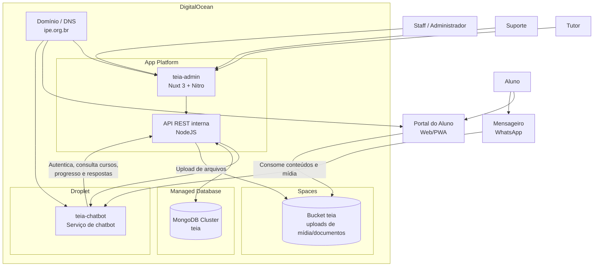

# Arquitetura da Aplicação TEIA

Este diagrama representa a arquitetura atual do ecossistema TEIA com base na documentação do projeto e na infraestrutura em produção na DigitalOcean.

## Visão de Arquitetura (Aplicação + Infraestrutura)

## Componentes Principais

- `teia-admin` (App Platform): aplicação Nuxt 3 que entrega frontend administrativo e endpoints server-side.
- API interna (`server/api`): centraliza autenticação, CRUDs de domínio, upload e integração do chatbot.
- MongoDB (Managed Database): persistência principal de usuários, cursos, módulos, tópicos, progresso e respostas.
- Spaces: armazenamento de arquivos enviados (imagens, thumbnails, documentos e mídias).
- `teia-chatbot` (Droplet): serviço de conversação que consome endpoints `/api/chatbot/*` do `teia-admin`.
- Portal do Aluno (Web/PWA): experiência do aluno para consumo de conteúdo.

## Endpoints de Integração do Chatbot

Os principais endpoints usados na integração do chatbot são:

- `GET /api/chatbot/users`
- `GET /api/chatbot/courses`
- `GET /api/chatbot/courses/:id`
- `GET /api/chatbot/courses/:id/progress`
- `POST /api/chatbot/progress`
- `POST /api/chatbot/answers`

Todos requerem `Authorization: Bearer <token>`.
